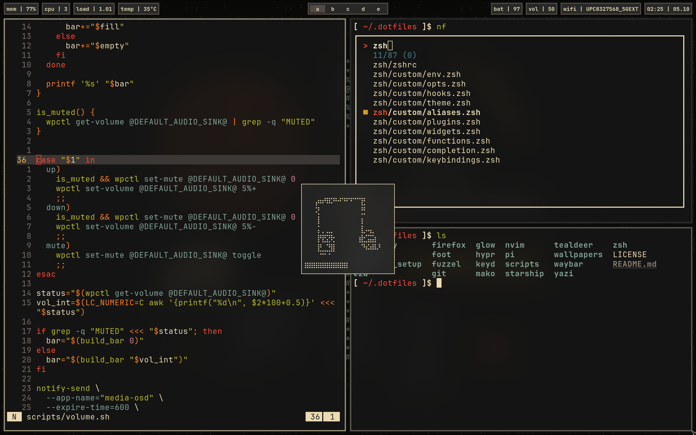

<div align="center">

## dotfiles - **handcrafted configs for questionable efficiency**



<p>
  
  
  
  
  
</p>
<p>
  
  
  
</p>

A Wayland-centric, keyboard-first development environment with sensible defaults
and a consistent Gruvbox theme across every tool.

</div>

---

## What's inside

| Area | Configs |
|---|---|
| Compositor | Hyprland, hyprpaper, hyprlock, hypridle |
| Terminals | foot, alacritty |
| Shell | zsh + zcomet, starship prompt, vi mode |
| Editor | Neovim (Lua): plugins, keymaps, LSP, autocommands |
| Desktop | waybar, fuzzel, mako, firefox |
| CLI | git, fzf, bat, eza, tealdeer, btop, delta |
| System | keyd, JetBrains Mono Nerd Font |

---

## Installation

```sh
git clone git@github.com:michal-pielka/dotfiles.git
cd dotfiles/dotfiles_setup
./setup.sh
```

The script installs common dependencies, symlinks selected modules into your
home directory, sets zsh as the default shell, and can install the fonts.
Review it before running.

---

## Personalization

Opinionated but readable. Fork it, copy what you need, and keep
machine-specific overrides out of version control.
