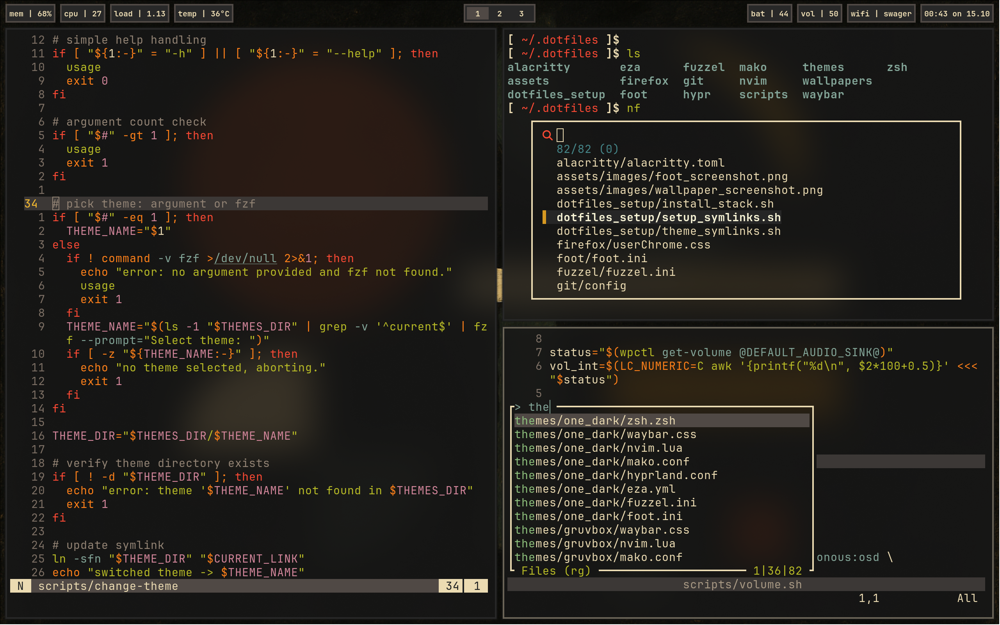

# dotfiles - handcrafted configs for questionable efficiency.

  

A clean, modern Wayland-centric development environment centered around:
- hyprland (Wayland compositor)
- foot (fast, minimal terminal emulator)
- zsh
- neovim (modal editor configured in Lua)

These dotfiles aim for a productive, minimal, and keyboard-first workflow with sensible defaults and clear structure, designed for a mostly terminal workflow.

---

- Supported and tested on:
  - Asahi Linux (Fedora-based on Apple Silicon)
  - Ubuntu

---

## Key components

- hyprland: tiling, window rules, and keybindings
- foot: styling
- zsh: aliases, plugins, completions, prompt
- neovim: plugins, keymaps, autocommands, options and LSP setup

---

## Tools configured by these dotfiles

- neovim
- foot
- alacritty
- zsh
- hypr (Hyprland, hyprpaper, hyprlock, hypridle)
- waybar
- fuzzel
- mako
- fzf
- bat
- eza
- git
- firefox
- keyd
- starship

## Additional tools used

- fdfind
- tealdeer
- btop
- wl-clipboard
- grim
- slurp
- imagemagick
- delta

Fonts
- JetBrains Mono Nerd Font

---

## Highlights

- ASCII OSD via mako for volume/brightness
  - Media keys trigger small shell scripts that adjust levels and send a monospace ASCII art via notify-send, styled with mako.

  
  

- Universal theme switcher: change-theme
  - One command to apply coherent theming defined in themes/theme_name across hyprland, neovim, waybar, mako, foot, fuzzel, zsh and eza.

  
  

---

## Installation

Simply clone the repository and use the setup.sh script located in dotfiles_setup directory for a guided install.

What the script typically does (review it first):
- Installs common dependencies and tools.
- Symlinks selected modules into your home directory.
- Sets Zsh as your default shell and installs oh-my-zsh.
- Can offer to install fonts (e.g., JetBrains Mono Nerd Font).

---

## Contributing / Personalization

These dotfiles are opinionated but intended to be readable and adaptable. Fork or copy what you need, keep machine-specific overrides out of version control, and feel free to propose improvements.

---
